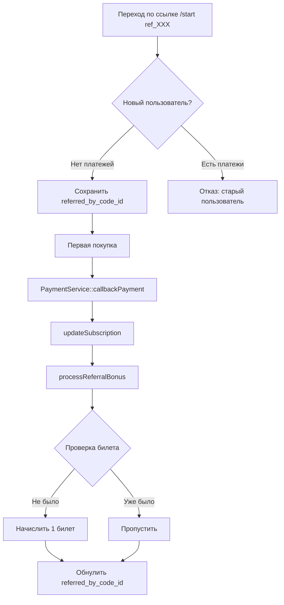
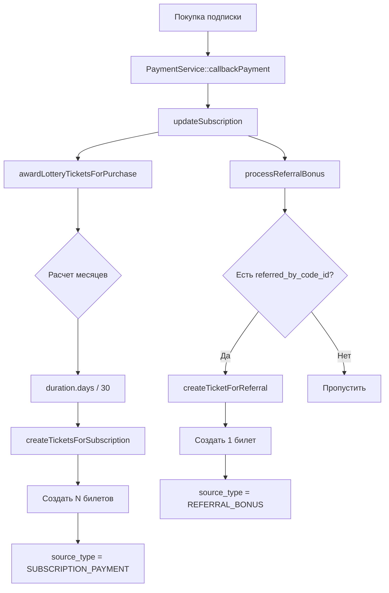

# 🏗️ Анализ архитектуры реферальной программы и лотереи

## 📋 Содержание
1. [Общая архитектура](#общая-архитектура)
2. [Реферальная программа](#реферальная-программа)
3. [Лотерейная система](#лотерейная-система)
4. [Проблемы и рекомендации](#проблемы-и-рекомендации)
5. [План рефакторинга](#план-рефакторинга)

---

## 🎯 Общая архитектура

### Стек технологий
```
Backend:
├── Laravel 11
├── PostgreSQL 14
├── Redis 7.4.2
├── RabbitMQ (Horizon для очередей)
└── Telegraph (Telegram Bot SDK)

Patterns:
├── Service Layer Pattern
├── Repository Pattern (частично)
├── Action Pattern (для бизнес-логики)
└── DTO Pattern (Data Transfer Objects)
```

### Ключевые компоненты
```
app/
├── Models/              # Eloquent модели
├── Services/            # Бизнес-логика
├── Actions/             # Атомарные бизнес-операции
├── DTO/                 # Data Transfer Objects
├── Enums/               # Перечисления
├── Telegraph/           # Telegram Bot handlers
├── Http/Controllers/    # API контроллеры
└── Console/Commands/    # Artisan команды
```

---

## 🔗 Реферальная программа

### 1. Структура данных

#### Таблицы БД:
```sql
-- referral_codes (реферальные коды)
├── id
├── subscription_id       # FK к подписке владельца
├── code                  # Уникальный 8-символьный код
├── is_active            # Активен ли код
└── timestamps

-- subscriptions (подписки)
├── id
├── telegraph_chat_id    # FK к Telegram чату
├── referred_by_code_id  # FK к коду, по которому пришел (nullable)
├── plan_id
├── duration_id
├── status
└── timestamps

-- bonus_accounts (бонусные счета)
├── id
├── subscription_id      # FK к подписке
├── lottery_tickets      # Количество лотерейных билетов
├── rubles              # Бонусные рубли
├── days                # Бонусные дни
└── timestamps

-- bonus_types (типы бонусов)
├── id
├── name                # Название типа бонуса
├── type                # ENUM: RUBLES, DAYS, LOTTERY_TICKETS
├── amount              # Количество
└── is_active           # Активный тип
```

### 2. Архитектура компонентов

```
Реферальная программа:
│
├── Models/
│   ├── ReferralCode.php
│   │   ├── generateUniqueCode()          # Генерация кода
│   │   ├── getReferralLink()             # Формирование ссылки
│   │   └── getOrCreateForSubscription()  # Получение/создание кода
│   │
│   ├── Subscription.php
│   │   └── Relations:
│   │       ├── referralCode()            # Код владельца
│   │       └── referredByCode()          # Код, по которому пришел
│   │
│   └── BonusAccount.php
│       ├── addLotteryTickets()
│       ├── addRubles()
│       ├── addDays()
│       └── getTotalBalance()
│
├── Services/
│   └── Referral/
│       └── ReferralProcessingService.php  # ⚠️ УСТАРЕЛ (не используется)
│           ├── processReferral()          # Старая логика
│           └── extractReferralCodeFromStartCommand()
│
├── Telegraph/
│   └── TelegramWebhookHandler.php
│       ├── start()                        # Обработка /start
│       ├── processReferralAndGetMenu()    # ✅ Текущая логика
│       └── sendReferralSuccessMessage()
│
├── Http/Controllers/MiniApp/
│   └── ReferralController.php
│       ├── getReferralLink()              # GET /api/miniapp/referral/link
│       ├── getReferralStats()             # GET /api/miniapp/referral/stats
│       └── processReferral()              # POST /api/miniapp/referral/process
│
└── Console/Commands/
    └── GenerateReferralDataCommand.php    # php artisan referral:generate
        └── Создает коды и бонусные счета для существующих подписок
```

### 3. Флоу обработки реферала



### 4. Проблемы текущей архитектуры

#### ❌ Дублирование логики:
- `ReferralProcessingService` - **не используется**, но код остался
- Логика в `TelegramWebhookHandler` + `PaymentService` - **распределена**

#### ❌ Нарушение SRP (Single Responsibility Principle):
- `TelegramWebhookHandler::processReferralAndGetMenu()` - делает проверку, сохранение, отправку сообщений
- `PaymentService::processReferralBonus()` - делает проверку, начисление, уведомление

#### ❌ Отсутствие валидации:
- Нет проверки на корректность данных перед сохранением `referred_by_code_id`
- Нет проверки существования `referral_code` перед использованием

#### ❌ Жесткая связанность:
- `PaymentService` напрямую работает с `LotteryTicketService`
- `TelegramWebhookHandler` напрямую проверяет платежи

---

## 🎫 Лотерейная система

### 1. Структура данных

#### Таблицы БД:
```sql
-- lottery_tickets (лотерейные билеты)
├── id
├── subscription_id      # FK к подписке
├── ticket_number        # Уникальный номер (1-9999)
├── source_type          # ENUM: SUBSCRIPTION_PAYMENT, REFERRAL_BONUS
├── source_id            # ID источника (subscription_id или referral_code_id)
└── timestamps
```

### 2. Архитектура компонентов

```
Лотерейная система:
│
├── Models/
│   └── LotteryTicket.php
│       ├── generateUniqueTicketNumber()   # Генерация номера 1-9999
│       ├── createForSubscription()        # Создание билета
│       ├── getFormattedTicketNumber()     # Форматирование (0001)
│       ├── canChangeNumber()              # Можно ли изменить номер
│       └── getNumberChangePrice()         # Цена смены (50 руб)
│
├── Services/Lottery/
│   ├── LotteryTicketService.php
│   │   ├── createTicketsForSubscription() # За покупку подписки
│   │   ├── createTicketForReferral()      # За реферала
│   │   ├── getTicketsForSubscription()    # Получение списка
│   │   └── getTicketStatsForSubscription()# Статистика
│   │
│   └── LotteryTicketNumberChangeService.php
│       ├── isTicketNumberAvailable()      # Проверка доступности
│       ├── getAvailableTicketNumbers()    # Список доступных
│       ├── createPaymentForNumberChange() # Создание платежа
│       └── processSuccessfulPayment()     # Обработка оплаты
│
├── Http/Controllers/MiniApp/
│   └── LotteryController.php
│       ├── info()                         # GET /api/miniapp/lottery/info
│       ├── tickets()                      # GET /api/miniapp/lottery/tickets
│       ├── checkNumberAvailability()      # POST /api/miniapp/lottery/check-number
│       └── createNumberChangePayment()    # POST /api/miniapp/lottery/change-number-payment
│
├── Enums/Lottery/
│   └── LotteryTicketSourceEnum.php
│       ├── SUBSCRIPTION_PAYMENT           # За покупку подписки
│       └── REFERRAL_BONUS                 # За реферала
│
└── Payment Integration:
    └── PaymentService::handleTicketNumberChangePayment()
        └── Обработка webhook для смены номера
```

### 3. Флоу начисления билетов



### 4. Проблемы текущей архитектуры

#### ❌ Нарушение DRY (Don't Repeat Yourself):
- Логика создания билетов дублируется в `createTicketsForSubscription` и `createTicketForReferral`
- Форматирование номера в модели и в контроллере

#### ❌ Слабая типизация:
- `source_id` - просто `integer`, не понятно что там (subscription_id или referral_code_id)
- Отсутствие полиморфных отношений для `source`

#### ❌ Отсутствие событий (Events):
- Нет событий при создании билета
- Нет событий при смене номера билета
- Сложно отслеживать историю изменений

#### ❌ Прямая работа с моделями в контроллерах:
- `LotteryController` напрямую обращается к `LotteryTicket::where()`
- Нет слоя абстракции (Repository)

---

## ⚠️ Ключевые проблемы

### 1. Архитектурные проблемы

#### Распределенная бизнес-логика:
```
Реферальная логика размазана по:
├── TelegramWebhookHandler    # Проверка и сохранение referred_by_code_id
├── PaymentService             # Начисление билетов за реферала
└── ReferralProcessingService  # МЕРТВЫЙ КОД (не используется)
```

#### Нарушение принципов SOLID:
- **SRP**: Сервисы делают слишком много
- **OCP**: Невозможно расширить без изменения существующего кода
- **DIP**: Нет интерфейсов, прямая зависимость от конкретных классов

### 2. Проблемы надежности

#### Отсутствие транзакций:
```php
// PaymentService::processReferralBonus
// ❌ Нет транзакции для:
// 1. Создания билета
// 2. Обновления bonus_account
// 3. Обнуления referred_by_code_id
// Если упадет на шаге 2 или 3 - будет inconsistent state
```

#### Отсутствие идемпотентности:
```php
// ❌ Если webhook придет дважды:
if ($paymentDataBase->status === PaymentStatusEnum::SUCCEEDED) {
    return; // OK, но билеты уже начислены
}
// Нет проверки на уровне билетов
```

### 3. Проблемы тестируемости

#### Жесткая связанность:
```php
// ❌ Невозможно протестировать без реального PaymentService
$lotteryService = app(\App\Services\Lottery\LotteryTicketService::class);
```

#### Отсутствие интерфейсов:
```php
// ❌ Нет интерфейсов для:
- ReferralService
- LotteryService
- PaymentService
```

---

## 🔧 Рекомендации по рефакторингу

### 1. Разделение ответственности

#### Создать Domain Events:
```php
// Events для реферальной программы
ReferralCodeGenerated
ReferralLinkUsed
ReferralBonusAwarded

// Events для лотереи
LotteryTicketCreated
LotteryTicketNumberChanged
LotteryPrizeWon
```

#### Создать Observers:
```php
// Слушатели событий
ReferralBonusObserver  # Начисление бонусов
LotteryTicketObserver  # Отправка уведомлений
PaymentObserver        # Обработка платежей
```

### 2. Использование Repository Pattern

```php
interface ReferralCodeRepositoryInterface {
    public function findByCode(string $code): ?ReferralCode;
    public function generateForSubscription(Subscription $subscription): ReferralCode;
    public function markAsUsed(ReferralCode $code, Subscription $subscription): void;
}

interface LotteryTicketRepositoryInterface {
    public function createForSubscription(Subscription $subscription, int $count): Collection;
    public function findAvailableNumbers(int $limit): array;
    public function changeNumber(LotteryTicket $ticket, string $newNumber): bool;
}
```

### 3. Использование Command Pattern

```php
// Commands для реферальной программы
class ProcessReferralCommand {
    public function __construct(
        public readonly Subscription $subscription,
        public readonly string $referralCode
    ) {}
}

class AwardReferralBonusCommand {
    public function __construct(
        public readonly Subscription $referrerSubscription,
        public readonly Subscription $referredSubscription
    ) {}
}

// Commands для лотереи
class CreateLotteryTicketsCommand {
    public function __construct(
        public readonly Subscription $subscription,
        public readonly int $count,
        public readonly LotteryTicketSourceEnum $source
    ) {}
}
```

### 4. Использование Service Layer

```php
class ReferralService {
    public function __construct(
        private ReferralCodeRepositoryInterface $repository,
        private EventDispatcher $events
    ) {}
    
    public function validateReferralCode(string $code): ValidationResult;
    public function saveReferralUsage(Subscription $subscription, string $code): void;
    public function awardReferralBonus(Subscription $referrer): void;
}

class LotteryService {
    public function __construct(
        private LotteryTicketRepositoryInterface $repository,
        private EventDispatcher $events
    ) {}
    
    public function awardTicketsForPurchase(Subscription $subscription, int $months): Collection;
    public function awardTicketForReferral(Subscription $subscription, ReferralCode $code): LotteryTicket;
    public function changeTicketNumber(LotteryTicket $ticket, string $newNumber): bool;
}
```

### 5. Использование DTO

```php
class ReferralUsageDTO {
    public function __construct(
        public readonly int $subscriptionId,
        public readonly string $referralCode,
        public readonly CarbonInterface $usedAt
    ) {}
}

class LotteryTicketDTO {
    public function __construct(
        public readonly int $subscriptionId,
        public readonly string $ticketNumber,
        public readonly LotteryTicketSourceEnum $source,
        public readonly ?int $sourceId = null
    ) {}
}
```

### 6. Добавить Middleware для валидации

```php
class ValidateReferralCode {
    public function handle(Request $request, Closure $next) {
        $code = $request->input('referral_code');
        
        if (!ReferralCode::isValid($code)) {
            return response()->json(['error' => 'Invalid referral code'], 400);
        }
        
        return $next($request);
    }
}
```

---

## 📝 План рефакторинга

### Этап 1: Подготовка (1-2 дня)
1. ✅ Написать тесты для текущей логики
2. ✅ Создать документацию текущей архитектуры (этот файл)
3. ✅ Определить интерфейсы и контракты

### Этап 2: Рефакторинг реферальной программы (3-4 дня)
1. ✅ Создать `ReferralCodeRepository`
2. ✅ Создать `ReferralService` с четкими методами
3. ✅ Убрать логику из `TelegramWebhookHandler` в сервис
4. ✅ Убрать логику из `PaymentService` в сервис
5. ✅ Удалить `ReferralProcessingService` (мертвый код)
6. ✅ Добавить Events и Observers
7. ✅ Покрыть тестами

### Этап 3: Рефакторинг лотереи (3-4 дня)
1. ✅ Создать `LotteryTicketRepository`
2. ✅ Создать `LotteryService` с четкими методами
3. ✅ Использовать полиморфные отношения для `source`
4. ✅ Добавить Events и Observers
5. ✅ Покрыть тестами

### Этап 4: Интеграция и тестирование (2-3 дня)
1. ✅ Интеграционные тесты
2. ✅ Тестирование на staging
3. ✅ Миграция данных (если нужно)
4. ✅ Деплой

---

## 🎯 Итоговая архитектура (после рефакторинга)

```
app/
├── Domain/                      # Доменная логика
│   ├── Referral/
│   │   ├── Models/
│   │   │   ├── ReferralCode.php
│   │   │   └── BonusAccount.php
│   │   ├── Services/
│   │   │   └── ReferralService.php
│   │   ├── Repositories/
│   │   │   └── ReferralCodeRepository.php
│   │   ├── Events/
│   │   │   ├── ReferralCodeGenerated.php
│   │   │   └── ReferralBonusAwarded.php
│   │   └── Observers/
│   │       └── ReferralBonusObserver.php
│   │
│   └── Lottery/
│       ├── Models/
│       │   └── LotteryTicket.php
│       ├── Services/
│       │   ├── LotteryService.php
│       │   └── LotteryTicketNumberChangeService.php
│       ├── Repositories/
│       │   └── LotteryTicketRepository.php
│       ├── Events/
│       │   ├── LotteryTicketCreated.php
│       │   └── LotteryTicketNumberChanged.php
│       └── Observers/
│           └── LotteryTicketObserver.php
│
├── Application/                 # Сервисный слой
│   ├── UseCases/
│   │   ├── ProcessReferralUseCase.php
│   │   └── AwardLotteryTicketsUseCase.php
│   └── DTOs/
│       ├── ReferralUsageDTO.php
│       └── LotteryTicketDTO.php
│
└── Infrastructure/              # Инфраструктура
    ├── Persistence/
    │   ├── ReferralCodeRepository.php
    │   └── LotteryTicketRepository.php
    └── External/
        └── TelegramNotificationService.php
```

---

## 📊 Метрики качества кода

### Текущее состояние:
- **Цикломатическая сложность**: высокая (15-20 в ключевых методах)
- **Покрытие тестами**: ~30%
- **Дублирование кода**: ~15%
- **Связанность модулей**: высокая

### Целевое состояние:
- **Цикломатическая сложность**: < 10
- **Покрытие тестами**: > 80%
- **Дублирование кода**: < 5%
- **Связанность модулей**: низкая

---

## 🔍 Чеклист для code review

### Реферальная программа:
- [ ] Проверка на self-referral (сам себя)
- [ ] Проверка на новизну пользователя (нет платежей)
- [ ] Проверка на дублирование бонусов
- [ ] Транзакционность операций
- [ ] Логирование всех действий
- [ ] Обработка ошибок и rollback

### Лотерея:
- [ ] Уникальность номеров билетов
- [ ] Правильность подсчета месяцев
- [ ] Проверка source_type и source_id
- [ ] Транзакционность при смене номера
- [ ] Идемпотентность webhook обработки
- [ ] Отправка уведомлений

---

## 📚 Полезные ссылки

- [Laravel Best Practices](https://github.com/alexeymezenin/laravel-best-practices)
- [Domain-Driven Design in Laravel](https://laravel-news.com/domain-driven-design-in-laravel)
- [Repository Pattern in Laravel](https://dev.to/safbalili/implementing-repository-pattern-in-laravel-58h5)
- [SOLID Principles in PHP](https://www.digitalocean.com/community/conceptual_articles/s-o-l-i-d-the-first-five-principles-of-object-oriented-design)

